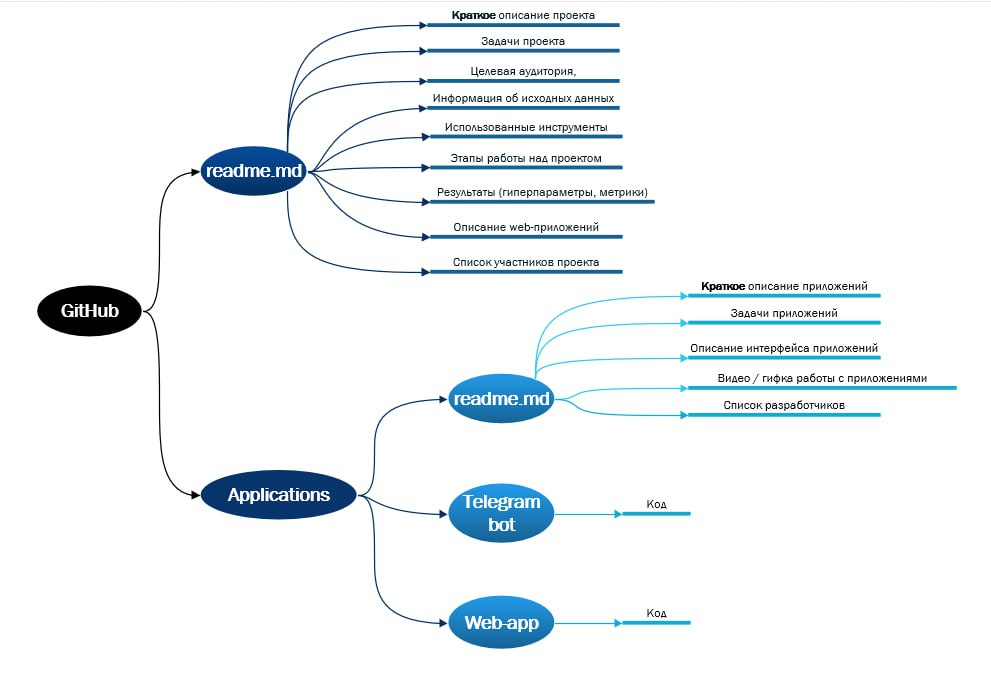
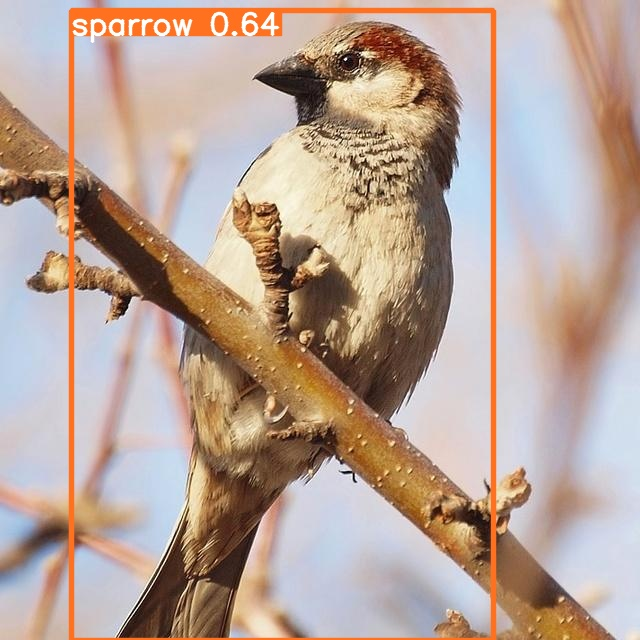

# 
 Описание модели

## Краткое описание
Это модель для анализа фотографий птиц. Датасет частично собран и размечен самостоятельно, частично использованы данные из открытых источников. Для разметки и подготовки данных использовали Roboflow. Дообучали Yolo8 в Google Colab. 

**Датасет:** (ссылка на сайте робофлоу)

**Веса:** (локальная ссылка на полученные веса)

**Ссылка на ноутбук:** локальная ссылка, либо ссылка на Colab

## Задача модели

Модель принимает фотографию, на которой может быть одна или несколько птиц и возвращает список найденных птиц, а также фотографию, на которой найденные птицы обведены квадратом и подписано их наименование.

## Датасет

### Сбор и разметка своего датасета

### Первоначальная идея: сбор данных из видеопотока

Исходная постановка бизнес-задачи подразумевала, что модель должна справляться с анализом изображений, полученных с оснащенных веб-камерой кормушек для птиц. Соответственно, в качестве изображений для обучения было решено взять кадры из видео, полученных с таких кормушек, размещенных на платформе youtube.

Были использованы два альтернативных подхода:

#### Ввод ссылки на соответствующее видео в интерфейс Roboflow, и последующее разбиение видео на кадры с использованием инструментов платформы. 
Плюсом этого подхода являлась проста, однако были две проблемы. 
Во-первых, разбиение видео, в примеру, на один кадр в секунду часто приводило к неоптимальному выбору кадров, птицы были в движении и поэтому размыты, либо кормушка была пустой.
Во-вторых, roboflow не позволял сохранять видео с кормушек, работающих режиме Live, то есть осуществляющих непрерывный стримминг.

#### Сохранение видеопотока на локальный компьютер и ручным сохранением удачных кадров из видеопотока в датасет для последующей загрузки в Roboflow. 
Такой подход был несколько более требовательным к оператору, но давал большее количество качественных изображений.

Логичные шаги для дальнейшего развития проекта: использовать уже обученную сеть (либо дообучить вариант попроще) для анализа видео и идентификации просто наличия птицы в кадре и сохранения кадра в будущий датасет. Это позволит заметно увеличить число изображений с хорошим качеством.

Общей обнаруженной проблемой анализа видео из кормушек было то, что за ограниченное время на сбор датасета было сложно получить изображения из большого числа разных кормушек. За счет этого модель хорошо работала для анализа изображений из кормушек, на которых ее обучали, но не всегда справлялась с изображениями из других кормушек. 
Одна из причин такого поведения - многие птицы, посещающие кормушки, всегда прилетали в конкретный ее фрагмент, причем это бывало связано не только с привычками конкретного экземпляра, а еще и с особенностями поведения всего вида. Например, поползни, за счет умения передвигаться вниз головой, часто выбирали те места, которые были недоступны другим птицам, а дятлы за счет длины клюва часто предпочитали кормиться там, где только они могли достать остатки еды.

Соответственно, при обучении модель демонстрировала тенденцию учитывать не только внешний вид птицы, но и конкретное место кормушки, где она кормилась, что приводило к периодическим ошибкам распознавания. В связи с этим было принято решения дополнить датасет данными из открытых источников, на которых птицы располагались на различном фоне и занимали большую часть изображения.

### Сбор данных из открытых источников

На платформе Roboflow уже было некоторое количество хороших датасетов с фотографиями птиц. Было решено использовать комбинацию из нескольких. 
Большая часть изображений была взята из следующего датасета: https://universe.roboflow.com/michael-heinrich-0ihib/bird-detection-kamqc. Он был выбран, поскольку в нем уже есть почти 50000 изображений, не удалось найти проблем с разметкой, всегда на фотографии одна птица, занимающая значительную часть изображения, и указаны именно наименования птиц, а не их соответствие численном классу (как было, например, в случае датасета https://universe.roboflow.com/yiyi-wang/nabirds, из которого, тем не менее, тоже было взято какое-то число изображений).

Исходно также планировали использовать датасет https://universe.roboflow.com/leem-pf8fb/bird-v2, содержащий качественно размеченные данные, но за счет того, что он был размечен для задачи сегментации (птицы были выделены на органичивающим прямоугольником, а обводящей линией) использовать эта данные одновременно с другими данными датасета без дополнительной подготовки было невозможно. 

Одна из проблем, связанных с использованием готовых датасетов была связана с их географической привязкой. Те датасеты, которые удалось найти, содержали в основном птиц, характерных для американского континента. Соответственно, там отсутствовали некоторые типичные для РФ птицы, такие как большая синица или лазоревка, а типичные представители дроздов и дятлов несколько отличались от тех, которые наблюдаются в РФ. Эту проблему решали посредством объединением нескольких видов с похожими характеристиками в отдельные классы.

## Выбор классов
Хотя разнообразие птиц, посещающих кормушки, достаточно велико, с учетом ограничения по времени и невозможности использования слишком большого датасета для обучения модели в Google Colab на бесплатной подписке было принято решение ограничиться восемью классами птиц.
Выбор классов осуществляли на основе принадлежности индивидуальных видов к одному семейству и общей визуальной схожести. Разумеется, полноценной решение исходной бизнес-задачи потребует расширения множества классов, однако при использовании соответствующих ресурсов для обучения это не должно представить существенную проблему.

Для 

|№|Класс|Виды|Пример 1|Пример 2| Пример 3 |
|:---:|:---:|:---:|:---:|:---:|:---:|
|1|sparrow|Воробей домовой, воробей полевой, чернобровая овсянка|| | |
|2|pigeon|голубь, вяхирь, горлинка| | |

Пример данных из датасета, когда есть несколько птиц

## `Аугментация данных`
Делали средствами робофлоу, использовали следующие параметры
Определяли параметры по логике и по 

# Модель

## Выбор модели для дообучения
Выбрали Yolo8, потому что она одна из последних, быстро учиться, хорошо работает.

## Гиперпараметры
25 эпох, хотя визуально казалось, что неплохо бы побольше, но мы были ограничены ресурсами на обучение - для бесплатного Colab это все, что получалось.

## Результаты обучения
Вставить картинки со сходимостью, с confusion matrices, с тем, 

#### Метрики обучения:

## Производительность на тестовых данных

Привести примеры

Ссылка на папку со всеми предсказаниями:

Причины ошибок

Выложить готовы веса сюда.

# Выводы