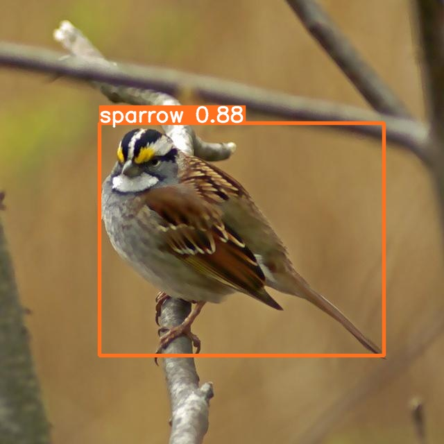
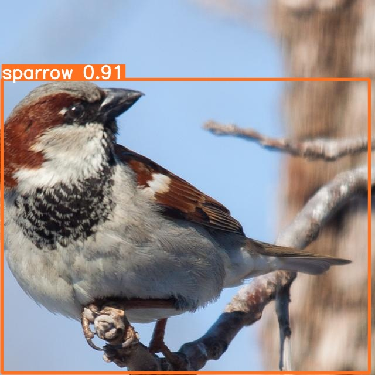
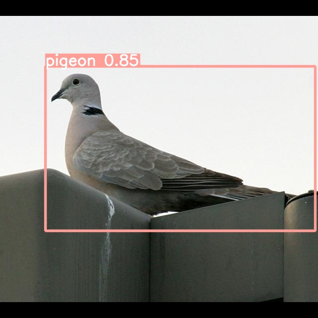
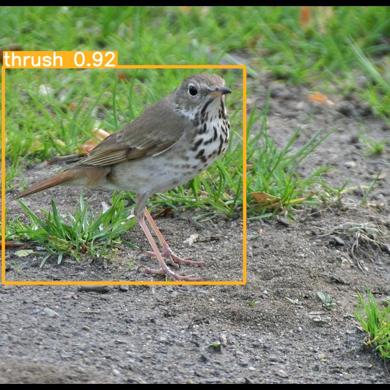
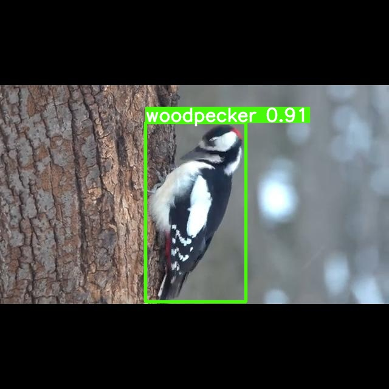
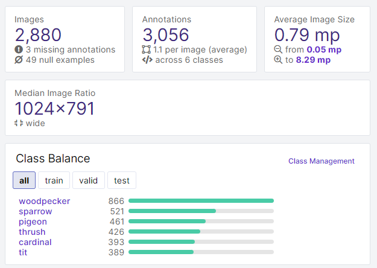
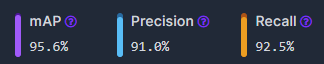
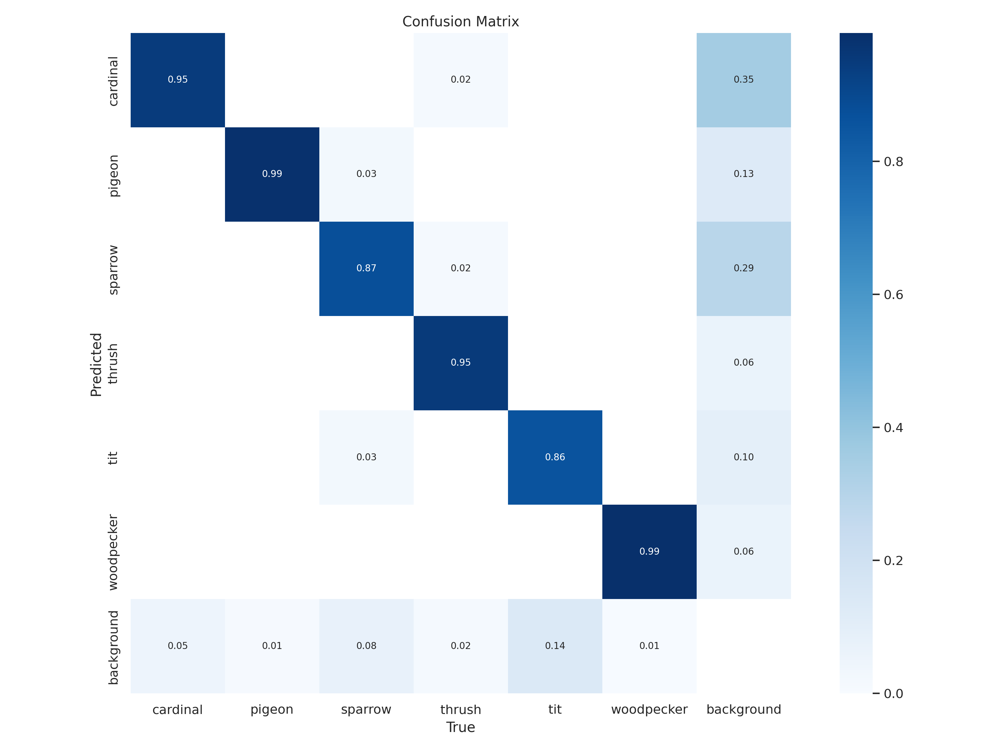
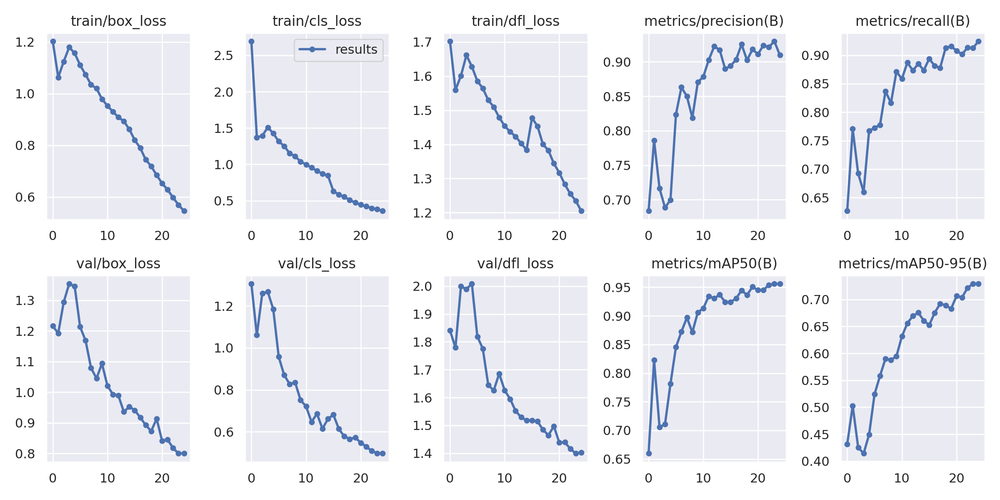

# 
 Модель

## <a id=1>Содержание</a>
- [Краткое описание модели](#2)
- [Задача модели](#3)
- [Предобработка данных](#4)
- [Создание модели](#5)
- [Выводы](#6)
___
## <a id=2>Краткое описание модели</a>
Это модель для анализа фотографий птиц. Датасет частично собран и размечен самостоятельно, частично использованы данные из открытых источников. Для разметки и подготовки данных использован Roboflow. Дообучали Yolo8 в Google Colab. 

**Датасет:** https://universe.roboflow.com/roboworkspace/birds-detection-riiaw/dataset/3

**Веса:** https://github.com/NazarovMichail/Birds-Detection/blob/master/Model/predict/best.pt

**Ссылка на ноутбук:** https://github.com/NazarovMichail/Birds-Detection/blob/master/Model/Model_Colab_1.ipynb

**Деплоймент на Roboflow:** https://universe.roboflow.com/roboworkspace/birds-detection-riiaw/model/3

## <a id=3>Задача модели</a>

Модель принимает фотографию, на которой может быть одна или несколько птиц и возвращает список найденных птиц, а также фотографию, на которой найденные птицы обведены квадратом и подписано их наименование.

## <a id=4>Предобработка данных</a>

### Сбор и разметка своего датасета

### Первоначальная идея: сбор данных из видеопотока

Исходная постановка бизнес-задачи подразумевала, что модель должна справляться с анализом изображений, полученных с оснащенных веб-камерой кормушек для птиц. Соответственно, в качестве изображений для обучения было решено взять кадры из видео, полученных с таких кормушек, размещенных на платформе youtube.

Были использованы два альтернативных подхода:

#### Ввод ссылки на соответствующее видео в интерфейс Roboflow, и последующее разбиение видео на кадры с использованием инструментов платформы. 
Плюсом этого подхода являлась проста, однако были две проблемы. 
Во-первых, разбиение видео, в примеру, на один кадр в секунду часто приводило к неоптимальному выбору кадров, птицы были в движении и поэтому размыты, либо кормушка была пустой.
Во-вторых, Roboflow не позволял сохранять видео с кормушек, работающих режиме Live, то есть осуществляющих непрерывный стримминг.

#### Сохранение видеопотока на локальный компьютер и ручным сохранением удачных кадров из видеопотока в датасет для последующей загрузки в Roboflow. 
Такой подход был несколько более требовательным к оператору, но давал большее количество качественных изображений.

Логичные шаги для дальнейшего развития проекта: использовать уже обученную сеть (либо дообучить вариант попроще) для анализа видео и идентификации просто наличия птицы в кадре и сохранения кадра в будущий датасет. Это позволит заметно увеличить число изображений с хорошим качеством.

Общей обнаруженной проблемой анализа видео из кормушек было то, что за ограниченное время на сбор датасета было сложно получить изображения из большого числа разных кормушек. За счет этого модель хорошо работала для анализа изображений из кормушек, на которых ее обучали, но не всегда справлялась с изображениями из других кормушек. 
Одна из причин такого поведения - многие птицы, посещающие кормушки, всегда прилетали в конкретный ее фрагмент, причем это бывало связано не только с привычками конкретного экземпляра, а еще и с особенностями поведения всего вида. Например, поползни, за счет умения передвигаться вниз головой, часто выбирали те места, которые были недоступны другим птицам, а дятлы за счет длины клюва часто предпочитали кормиться там, где только они могли достать остатки еды.

Соответственно, при обучении модель демонстрировала тенденцию учитывать не только внешний вид птицы, но и конкретное место кормушки, где она кормилась, что приводило к периодическим ошибкам распознавания. В связи с этим было принято решения дополнить датасет данными из открытых источников, на которых птицы располагались на различном фоне и занимали большую часть изображения.

### Сбор данных из открытых источников

На платформе Roboflow уже было некоторое количество хороших датасетов с фотографиями птиц. Было решено использовать комбинацию из нескольких. 
Большая часть изображений была взята из следующего датасета: https://universe.roboflow.com/michael-heinrich-0ihib/bird-detection-kamqc. Он был выбран, поскольку в нем уже есть почти 50000 изображений, не удалось найти проблем с разметкой, всегда на фотографии одна птица, занимающая значительную часть изображения, и указаны именно наименования птиц, а не их соответствие численном классу (как было, например, в случае датасета https://universe.roboflow.com/yiyi-wang/nabirds, из которого, тем не менее, тоже было взято какое-то число изображений).

Исходно также планировали использовать датасет https://universe.roboflow.com/leem-pf8fb/bird-v2, содержащий качественно размеченные данные, но за счет того, что он был размечен для задачи сегментации (птицы были выделены на ограничивающим прямоугольником, а обводящей линией) использовать эта данные одновременно с другими данными датасета без дополнительной подготовки было невозможно. 

Одна из проблем, связанных с использованием готовых датасетов была связана с их географической привязкой. Те датасеты, которые удалось найти, содержали в основном птиц, характерных для американского континента. Соответственно, там отсутствовали некоторые типичные для РФ птицы, такие как большая синица или лазоревка, а типичные представители дроздов и дятлов несколько отличались от тех, которые наблюдаются в РФ. Эту проблему решали посредством объединением нескольких видов с похожими характеристиками в отдельные классы.

### Выбор классов
Хотя разнообразие птиц, посещающих кормушки, достаточно велико, с учетом ограничения по времени и невозможности использования слишком большого датасета для обучения модели в Google Colab на бесплатной подписке было принято решение ограничиться восемью классами птиц.
Выбор классов осуществляли на основе принадлежности индивидуальных видов к одному семейству и общей визуальной схожести. Разумеется, полноценной решение исходной бизнес-задачи потребует расширения множества классов, однако при использовании соответствующих ресурсов для обучения это не должно представить существенную проблему.

|№|Класс|Виды|Пример 1|Пример 2| Пример 3 |
|:---:|:---:|:---:|:---:|:---:|:---:|
|1|sparrow|Воробей домовой, воробей полевой, чернобровая овсянка|| | |
|2|pigeon|голубь, вяхирь, горлинка| | ||
|3|pigeon|большая синица, лазоревка, черноголовая гаичка| | ||
|4|thrush|Дрозд-отшельник, певчий дрозд, Свенсонов дрозд| | ||
|5|woodpecker|Большой пестрый дятел, малый пестрый дятел, желтошапочный дятел| | | | 
|6|cardinal|Красный кардинал| |||

При самостоятельной разметке данных не ограничивались только кадрами, в которых птица находится в наиболее выигрышном ракурсе и занимает большую часть кадра, а старались внести в датасет разные ракурсы, а также кадры, на которых одновременно присутствует несколько птиц:

||

## Итоговый состав датасета

Достаточно большой разброс размеров изображений связан со спецификой сбора данных: часть изображений включают только одну птицу, часть - всю кормушку с несколькими птицами целиком.

**Если не исправим в следующей модели:**
Определенный дисбаланс, связанный с присутствием относительно большого числа дятлов, вызван тем, что на первой стадии при разметке использовали кормушки, которые часто посещались дятлами. Обучение показало, что это не приводит к значительным проблемам в работе модели - как правило, модель не демонстрировала тенденции к классификации других птиц как дятлов.

### Разделение данных на сеты, их предобработка и аугментация

**Разбивка на сеты:**
Training set: 2123 шт (74%)
Validation set: 517 шт (18%)
Testing set: 240 шт (8%)

**Использованная предобработка**
1. Авто-ориентация для исключения влияния EXIF-метаданных
2. Изменение размера и обрезка под квадрат *(Resize: Fill (with center crop)*, выбранный размер - 640x640 

**! Возможно, что стоит использовать вариант без обрезки, слишком много попадается картинок, на которых только часть птицы**

**Использованная аугментация**
Flip: Horizontal, Vertical
Saturation: Between -29% and +29%
Exposure: Between -21% and +21%

## <a id=5>Создание модели</a>

### Выбор модели для дообучения
В качестве модели для обучения была выбрана YOLO 8. Решение было принято с учетом следующий факторов:

- Повышенная точность: по многочисленным отзывам YOLOv8 включает ряд улучшений в архитектуре, способствующих к повышению точности как задач обнаружения, так и классификации, особенно для сложных объектов (в том числе таких как птицы, которые сильно различаются по размеру, цвету и форме).

- Скорость: модели YOLO известны своими возможностями обработки в реальном времени.С учетом того, что в перспективе задача может включать обработку видеопотоков в реальном времени или большого объема изображений, это особенно ценно.

- Интеграция с Roboflow и возможность быстрого и легко обучения в Google Colab.

### Гиперпараметры

Основным настраиваемым параметров при обучении было количество эпох. Тем не менее для собранного датасета при обучении в Google Colab практически никогда не удавалось добиться обучения на более чем 25 эпохах, при больших значениях Google Colab через какое-то время останавливал процесс и предлагал дальше считать без GPU. Тем не менее, судя по графикам (см. далее), имело бы смысл увеличить количество эпох.

Параметры модели (определяемые автоматически): 225 layers, 11137922 parameters, 11137906 gradients, 28.7 GFLOPs

### Результаты обучения

#### Метрики в ходе обучения:

### Производительность на тестовых данных

**Вставить сюда ряд конкретных примеров**

Папка, содержащая все результаты из test dataset: https://drive.google.com/drive/folders/1R0CsHH_sdFVmgQJj2fDTePtBjUKYAT7d?usp=drive_link

**Типовые ошибки модели и их причины**

## <a id=6>Выводы</a>

___
[К содержанию](#1)