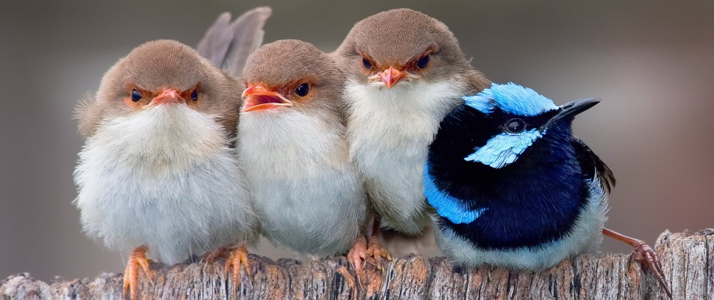

# `Birds Detection`

 ## Описание проекта

Проект разработан для детектирования по видео, фото изображениям птиц в интересах ученых, орнитологов, любителей птиц.

## Описание проблемы

Для **ученых и орнитологов** изучение перелетов птиц важно для:
- получения информации о местах расселения определенных видов птиц, их численности, выживаемости и скорости размножения
- исследования глобальных проблем, например глобального потепления
- контроля распространения инфекций, переносимых  птицами

На рынке товаров для животных широко представлены кормушки с камерой для птиц, пользующиеся спросом у **орнитологов-любителей**. Кормушки с опцией детектирования птиц будут пользоваться еще большим спросом.

## Этапы решения

1. Сбор исходных видео и фотографий с птицами.
2. Разметка птиц на исходных материалах.
3. Обучение нейронной сети YOLOv8 по размеченным данным.
4. Тестирование нейронной сети на неразмеченных данных.
5. Создание телеграмм-бота для детектирования птиц, использующий обученную модель.
6. Тестирование телеграмм-бота.
7. Размещение телеграмм-бота на сервере.

## Результат

В результате проведенных работ была обучена модель нейронной сети YOLOv8 и получены следующие метрики качества:
- Доля верно классифицированных объектов из всех классификаций (precision):
- Доля верно классифицированных объектов из всех целевых объектов (precision):
- Средняя средняя точность для обнаружения объектов с порогом IoU < 50 (mAP50):
- Средняя средняя точность для обнаружения объектов с порогом IoU > 50 (mAP50-95): 

Разработан и размещен на сервере телеграмм-бот, детектирующий птиц на фотографиях.

## Структура проекта
## :arrow_right:[Перейти в Applications](https://github.com/NazarovMichail/Birds-Detection/tree/master/Applications)
## :arrow_right: [Перейти в Model](https://github.com/NazarovMichail/Birds-Detection/tree/master/Model)

